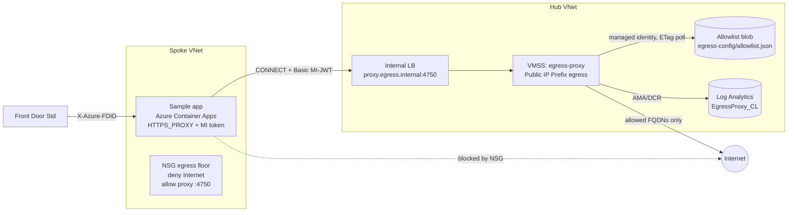

# Architecture

A **hub-and-spoke** topology. The proxy lives in the hub; workloads live in spokes and
reach it over VNet peering. The only sanctioned path to arbitrary third-party HTTPS is the
proxy; an NSG on the workload subnet denies direct Internet egress, so bypassing the proxy
fails closed.

## Load-bearing design decisions

| Decision | Why |
|---|---|
| **Explicit CONNECT proxy, no transparent fallback** | The proxy resolves the *named* destination itself; a compromised client can't SNI-spoof to an attacker IP under an allowed label. Transparent SNI-peeking is defeatable and is rejected as a security boundary. |
| **Enforcement = the NSG, not proxy opt-in** | `HTTPS_PROXY` is honour-system; the deny-Internet NSG makes the proxy the only route out. A workload that ignores the proxy gets no route (fail closed), not a silent leak. |
| **Identity = workload's managed-identity JWT** (not source IP/subnet) | Services can't be guaranteed to a subnet, and shared Container Apps environments collapse subnet granularity. The token is unforgeable and per-app. See [identity.md](identity.md). |
| **VMSS + Public IP Prefix, no NAT Gateway** | Third parties allowlist *your* egress IPs: instances draw public IPs from a fixed prefix — a known egress CIDR. Each instance gets its own 64k SNAT ports; scale out, not up. |
| **Internal Standard LB + stable DNS name** | Spokes target `proxy.egress.internal:4750`; instance IPs can change freely. |
| **Allowlist = one JSON blob, ETag reload** | Atomic writes, cheap conditional GETs, versioning/soft-delete as audit trail. See [allowlist.md](allowlist.md). |
| **Single static Go binary, reload folded in** | No sidecars, no container runtime on the VM, `systemd` restart is the reload. Distroless/nonroot when containerized (local dev). |
| **Anti-SSRF** | Smokescreen resolves the destination and blocks private/link-local ranges — the proxy cannot be used to reach internal IPs. This makes `NO_PROXY` load-bearing for the client (internal traffic must bypass the proxy). |

## Traffic classes

| Traffic | Path |
|---|---|
| Third-party HTTPS (the governed class) | app → proxy (CONNECT) → allowlist decision → internet |
| Azure PaaS via private endpoints, intra-VNet, IMDS, Azure Monitor | direct (on `NO_PROXY`, allowed by NSG) |
| Everything else to Internet | denied by NSG (and by the proxy's default deny) |

## What a deny looks like

The proxy answers the `CONNECT` with **HTTP 403**. Note: `curl` reports this as
`000`/exit 56 (it expects a tunnel, not a response) — that's a client artifact, not a
proxy failure. The decision (and the would-be destination) is in `EgressProxy_CL`.
