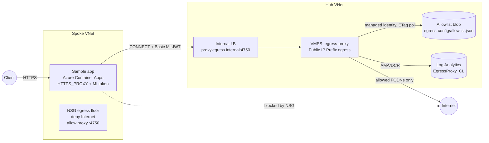

# Architecture

A **hub-and-spoke** topology. The proxy lives in the hub; workloads live in spokes and
reach it over VNet peering. The only sanctioned path to arbitrary third-party HTTPS is the
proxy; an NSG on the workload subnet denies direct Internet egress, so bypassing the proxy
fails closed.

```mermaid
flowchart LR
    subgraph spoke [Spoke VNet]
        APP[Sample app<br/>Azure Container Apps<br/>HTTPS_PROXY + MI token]
        NSG[NSG egress floor<br/>deny Internet<br/>allow proxy :4750]
    end
    subgraph hub [Hub VNet]
        LB[Internal LB<br/>proxy.egress.internal:4750]
        VMSS[VMSS: egress-proxy<br/>Public IP Prefix egress]
        ST[(Allowlist blob<br/>egress-config/allowlist.json)]
        LAW[(Log Analytics<br/>EgressProxy_CL)]
    end
    USER((Client)) -->|HTTPS| APP
    APP -->|CONNECT + Basic MI-JWT| LB --> VMSS
    VMSS -->|allowed FQDNs only| NET((Internet))
    VMSS -->|managed identity, ETag poll| ST
    VMSS -->|AMA/DCR| LAW
    APP -.blocked by NSG.-> NET
```

## Design decisions

| Decision | Why |
|---|---|
| **Explicit CONNECT proxy, no transparent fallback** | The proxy resolves the *named* destination itself; a compromised client can't SNI-spoof to an attacker IP under an allowed label. Transparent SNI-peeking is defeatable and is rejected as a security boundary. |
| **Enforcement = the NSG, not proxy opt-in** | `HTTPS_PROXY` is honour-system; the deny-Internet NSG makes the proxy the only route out. A workload that ignores the proxy gets no route (fail closed), not a silent leak. |
| **Identity = workload's managed-identity JWT** (not source IP/subnet) | Services can't be guaranteed to a subnet, and shared Container Apps environments collapse subnet granularity. The token is unforgeable and per-app. See [identity.md](identity.md). |
| **VMSS + Public IP Prefix, no NAT Gateway** | Third parties allowlist *your* egress IPs: instances draw public IPs from a fixed prefix — a known egress CIDR. Each instance gets its own 64k SNAT ports; scale out, not up. Standing in for a NAT Gateway also means inheriting its idle-drop behaviour — see [production-hardening.md § Idle timeouts](production-hardening.md#idle-timeouts--the-stale-tunnel-contract). |
| **Internal Standard LB + stable DNS name** | Spokes target `proxy.egress.internal:4750`; instance IPs can change freely. |
| **Allowlist = one JSON blob, ETag reload** | Atomic writes, cheap conditional GETs, versioning/soft-delete as audit trail. See [allowlist.md](allowlist.md). Written directly (GitOps) or, for per-team self-service, through a validating [control plane](control-plane.md) (Mode 2). |
| **Single static Go binary, reload folded in** | No sidecars, no container runtime on the VM, `systemd` restart is the reload. Distroless/nonroot when containerized (local dev). |
| **Anti-SSRF** | Smokescreen resolves the destination and blocks private/link-local ranges — the proxy cannot be used to reach internal IPs. This makes `NO_PROXY` load-bearing for the client (internal traffic must bypass the proxy). |

## What it doesn't do

The tunnel is end-to-end TLS between the workload and the third party. The proxy sees the
`CONNECT` line and the bytes' volume and timing — never the plaintext. It governs **where**
traffic goes, not **what** goes there.

Concretely, out of scope: DLP, malware/AV scanning, request-path or method granularity
(`api.example.com/v1/read` cannot be allowed while `/v1/admin` is denied), request or
response body policy, and anything that depends on the HTTP layer inside the tunnel. The
allowlist's unit is `host[:port]` and that is the finest grain available — see
[allowlist.md](allowlist.md).

The consequence is that **an allowed FQDN is a full-trust bidirectional
channel.** A compromised workload with `github.com` on its list can exfiltrate through
`github.com`, and the audit row will read as a normal allow. The audit trail narrows this but
does not close it — `CANONICAL-PROXY-CN-CLOSE` carries `BytesIn`/`BytesOut`/`DurationMs` per
connection, so unusual volume to an allowed host is detectable after the fact
([observability.md](observability.md)). Policy hygiene is the real mitigation: prefer
vendor-specific hostnames over wildcards and shared CDN domains, since a wildcard on a domain
anyone can host under is an allowlist in name only.

Full inspection requires TLS interception (MITM with a trusted CA) and it is deliberately not
implemented here. This is a narrow focus solution aimed at gating network egress and preventing
malicious introspection. Where content-level control is genuinely required, it belongs at the 
application or at a dedicated CASB/DLP tier, that is a different solution that could be layered 
on top of this proxy.

## Traffic classes

| Traffic | Path |
|---|---|
| Third-party HTTPS (the governed class) | app → proxy (CONNECT) → allowlist decision → internet |
| Azure PaaS via private endpoints, intra-VNet, IMDS, Azure Monitor | direct (on `NO_PROXY`, allowed by NSG) |
| Everything else to Internet | denied by NSG (and by the proxy's default deny) |

## What a deny looks like

The proxy denies the `CONNECT` with **HTTP 407**. Its JWT-auth model is 407-based
(`Proxy-Authenticate: Basic` challenge), so both an unauthenticated and a policy-denied
tunnel surface as `407 Proxy Authentication Required`. Note: `curl` reports this as
`000`/exit 56 (it expects a tunnel, not a response) — that's a client artifact, not a
proxy failure. The decision (and the would-be destination) is in `EgressProxy_CL`.
