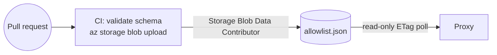
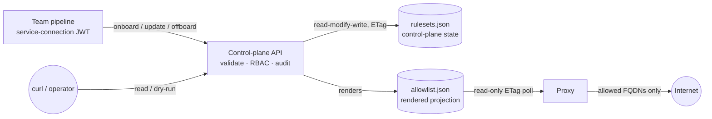

# Control plane

The control plane is a **validating write path in front of the allowlist**. It lets teams
self-serve their workload's egress rules from a deployment pipeline, without handing anyone
direct write access to the allowlist store. The proxy is unchanged — it still reads one
rendered ACL, fail-closed, on its ETag poll.

Code: [`src/ControlPlane/`](../src/ControlPlane/). Design record:
[`openspec/changes/control-plane-api/`](../openspec/changes/control-plane-api/).

## Operating modes

The allowlist can be maintained in one of four modes. Only **Mode 2** introduces the
control plane; the others frame where it sits.

| Mode | Who writes | Control plane? |
|---|---|---|
| **1 — GitOps** | one config file, PR-published on merge | **no** — direct blob write |
| **2 — Pipeline push** | each team's pipeline pushes its own ruleset via the API | **yes** |
| 3 — Management portal | humans edit via an app with per-ruleset RBAC | yes *(read-only half ships)* |
| 4 — Mix & match | different rulesets sit at different modes | yes *(future)* |

Mode 3 is the one that is half-built. A **read-only management console** ships — it reads this
API and shows the platform team what the configuration is and what the proxy did with it — but
nothing in it writes policy. See [§ The management console](#the-management-console-mode-3-read-only).

## The two topologies

The same proxy, the same blob, two different write paths. Pick per environment; both are
supported by the Bicep in [`infra/`](../infra/), gated on one parameter.

### Without the control plane — GitOps (Mode 1)



Teams edit [`allowlist/allowlist.json`](../allowlist/allowlist.json); PR review is the trust
boundary; CI publishes on merge. **Choose this when** one team (or one review queue) owns
every workload's egress, the change rate is low, and config-as-code review is the control you
want. It is the simplest thing that works, and it is what this repo ships by default.

**Cost:** every egress change funnels through one shared file. A team cannot push its own
workload's rules without touching an artifact everyone else shares, and the CI identity holds
blob write for *all* rules.

### With the control plane — pipeline push (Mode 2)



Each team's pipeline pushes **only its own ruleset**, through an API that enforces policy the
pipeline cannot skip. **Choose this when** several teams own their own workloads and you want
self-service without granting blob write per team.

**Cost:** one more service to run and keep available. Note the proxy does *not* depend on it —
the proxy reads the blob directly, so egress enforcement survives control-plane downtime.

### Switching between them

Both topologies end at the same `allowlist.json`, so switching is a role-assignment change
plus a seed, not a migration:

- **Mode 1 → Mode 2**: deploy the control plane (`DEPLOY_CONTROL_PLANE=true ./scripts/deploy.sh`,
  or `deployControlPlane=true` straight to bicep — see below), seed
  `rulesets.json` with the rulesets equivalent to today's modules and the platform `grants`,
  then stop the CI allowlist publish. From that point CI publishes by *calling the API*.
- **Mode 2 → Mode 1**: stop calling the API, re-point CI at the blob, and keep the last
  rendered `allowlist.json` as the config-as-code artifact. Nothing in the proxy changes.

## The ruleset model

A **ruleset** is the set of rules applied to one or more clients of the proxy. It is the unit
of policy, ownership, and authorization, and it replaces "module" as the thing teams author.
Schema: [`allowlist/rulesets.schema.json`](../allowlist/rulesets.schema.json).

```jsonc
{
  "name": "payments",                            // slug
  "subjects": [{ "appid": "<client-id>" },       // workload identities / netids it governs
               { "netid": "10.2.0.0/23" }],
  "content": {
    "allowed_hosts": ["api.stripe.com"],         // exact FQDNs
    "action": "enforce"                          // enforce | report | open — uniform for the ruleset
  },
  "acl": { "edit": [], "push": [], "admin": [] },// reserved for Mode 3 (human edit)
  "owner": "<creator identity>"                  // recorded trust-on-first-use at onboard
}
```

Invariants:

- **One-to-one.** A subject belongs to **at most one** ruleset. No composition, union, or
  precedence — a single uniqueness invariant replaces all of that, and keeps the renderer a
  validator rather than a compositor.
- **Uniform evaluation.** A ruleset has exactly one `action`; its hosts are never evaluated
  under differing actions.
- **Writer ≠ subject.** The identity allowed to write a ruleset is never the workload identity
  it governs. A compromised workload therefore cannot widen its own allowlist — the exact
  attack the proxy exists to stop.
- **Subjects change only with `bind`.** They are set at onboard, and a plain content `update`
  can never touch them (steady-state anti-hijack). A module grows, though — new workloads join
  it — so changing membership is a first-class operation gated by its own `bind` verb, not a
  teardown. (Restating the stored subjects unchanged needs nothing, so a desired-state pipeline
  can keep pushing one file; only a *change* requires `bind`.)

### Rendering: why `allowlist.json` never changes

The proxy parses `allowlist.json` itself, so its schema is a **frozen contract**. The control
plane keeps rulesets in its own document and renders that one into the proxy's:

```
rulesets.json  ──render──▶  allowlist.json  ──poll──▶  proxy
(authored)                  (frozen schema)
```

One module entry is emitted **per subject** — the proxy keys each ACL entry on a single
identity. A single-subject ruleset keeps the ruleset name as its `id`, so an existing
hand-written allowlist renders back byte-identically (pinned by a test). The word `modules`
survives only inside that rendered file; under Mode 2 nobody authors it by hand.

## Authorization: platform-managed RBAC

Authority to change rulesets is **platform-managed RBAC**, held in the `grants` section of the
same state document and edited by the platform team out of band:

| Verb | Grants | Scope |
|---|---|---|
| `onboard` | create a new ruleset (declaring its subjects) | registry — the ruleset doesn't exist yet |
| `update` | replace an existing ruleset's content (hosts + action) | that ruleset (or unscoped) |
| `bind` | change an existing ruleset's subjects (add/remove workloads) | that ruleset (or unscoped) |
| `offboard` | remove a ruleset, freeing its subjects | that ruleset (or unscoped) |

```jsonc
"grants": [
  { "identity": "<pipeline appid>", "verbs": ["onboard"] },
  { "identity": "<platform appid>", "verbs": ["onboard", "update", "offboard", "bind"] }  // unscoped
]
```

- **Reads are open.** Any authenticated caller may list and read every ruleset — the egress
  posture is transparent by design. Only writes require a verb.
- **Trust-on-first-use ownership.** When an `onboard`-holder creates a ruleset, it is recorded
  as `owner` and gains `update`/`bind`/`offboard` on it — so onboarding, and growing the module
  afterwards, cost one platform grant, not a ticket per ruleset.
- **Enforce, don't investigate.** The control plane enforces the platform's grants and
  **never** reaches into Azure (ARM/Graph) to verify which identity owns which subject.
  Squatting on an un-onboarded subject is bounded by how narrowly `onboard` is granted;
  uniqueness (first-come) protects already-onboarded subjects.
- The API **never writes the `grants` section** — every read-modify-write copies it through
  untouched, so the control plane cannot widen its own authority.

RBAC administration is a **platform-team responsibility**, done out of band for now; managing
it *through* the API is future work.

### Bootstrapping grants after a deploy

A freshly deployed control plane accepts **no writes from anyone**. `deploy.sh` seeds
[`allowlist/rulesets.json`](../allowlist/rulesets.json) with placeholder grant identities
(`22222222-…`, `55555555-…`, `99999999-…`) and patches only the sample app's *subject* — it
never writes a real identity into `grants`. Reads work for any authenticated caller; every
write returns `403` until the platform team adds a grant. That is deliberate (the API cannot
grant authority to itself), but it means one manual step stands between deployment and use:

1. `deployerPrincipalId` — you, or the CI identity that ran the deploy — receives
   `Storage Blob Data Contributor` on the allowlist storage. That role *is* the bootstrap.
2. Edit `egress-config/rulesets.json` directly and add the pipeline's identity to `grants`.
3. From then on that pipeline self-serves through the API; nothing else needs blob access.

**Grants only work for service principals.** An identity is matched against the token's
`appid`/`azp` claim, which carries the *application* that obtained the token. A human's token
carries the client app that signed them in (for `az`, `04b07795-8ddb-461a-bbee-02f9e1bf7b46`,
shared by every CLI user in the tenant) — never their user object id. So putting a user's
object id in `grants` has no effect, and putting the CLI's app id there would grant those verbs
to everyone using the CLI. Grant a dedicated service principal per pipeline instead.

## The blob as a private store

| | Blob role |
|---|---|
| Control-plane API identity | `Storage Blob Data Contributor` — the only service that writes |
| Proxy identity | `Storage Blob Data Reader` (read-only) |
| Workload team pipelines | **none** — they reach the config only through the API |
| Platform team identity | `Storage Blob Data Contributor` — it owns the `grants` section |

The powerful write role stays with the control plane and the platform team instead of being
sprayed across every team's pipeline. All policy (RBAC, the onboard gate, writer≠subject) is
therefore unavoidable on the write path. Blob **versioning + soft delete** (14 days) stay on
for rollback.

## API surface

| Endpoint | Verb required | Behaviour |
|---|---|---|
| `GET /rulesets` | none (auth only) | list all rulesets (transparency) |
| `GET /rulesets/{name}` | none (auth only) | read one ruleset |
| `GET /grants` | none (auth only) | read the platform-managed grants — *who may change policy* |
| `GET /fallback` | none (auth only) | read the fallback block — *what unmatched sources may reach*; absent or empty is reported as `deny_all` |
| `PUT /rulesets/{name}` (absent) | `onboard` | create it, set subjects, TOFU ownership; `report` if no action given |
| `PUT /rulesets/{name}` (exists) | `update` / owner (+ `bind` if subjects change) | **full replace** of content; changing subjects additionally needs `bind`; changing acl rejected |
| `POST /rulesets/{name}:check` | none (auth only) | dry-run: validate, return the same diff shape as a write, no write |
| `DELETE /rulesets/{name}` | `offboard` / owner | remove it, free its subjects (fail-closed) |

Status codes: `401` no/invalid token · `403` missing verb (including a subject change without
`bind`), or the caller is a governed subject · `400` invalid host, or an attempt to change the
frozen `acl` · `404` unknown ruleset ·
`409` subject already claimed by another ruleset, or sustained write contention ·
`503` saved, but publishing to the proxy failed (see *Failure modes*).

- **AuthN** reuses the proxy's RS256/JWKS token validation (`iss`/`aud`/`exp`) — one identity
  model across data plane and control plane.
- **`report` is the onboarding default, never an override.** A ruleset onboarded *without* an
  explicit action starts in `report` — the on-ramp for a workload whose egress you do not yet
  know: tune from the logs, then promote with an explicit `enforce` push. An explicit action is
  always honoured, at onboard and after: `report` permits all traffic and only logs it, so
  overriding an explicit `enforce` would give a new workload more egress than it asked for. The
  control plane never lowers a ruleset's action on its own either — adding a host to an
  *already enforcing* ruleset does **not** downgrade it. What guards widening is the audit event
  per added host plus the `:check` diff.
- **A write reports what it changed, in both halves.** `added`/`removed` list hosts;
  `bound`/`unbound` list subjects. Membership needs reporting for the same reason hosts do — a push
  is a full replace, so a bind can take a workload *away* as well as add one — and `:check` returns
  the identical shape without writing, so a pipeline can gate on a membership change before making
  it. The same events appear in the audit log as `subject ... BOUND to ruleset`.
- **`PUT` is a full replace (desired-state).** A team keeps a rules file per environment in its
  repo; the pipeline pushes that file, so the ruleset always matches the repo and a host absent
  from the push is removed. Removals are audited, and `:check` surfaces them before a push.
- **`grants` and `fallback` are readable, never writable.** Both live in the state document and had
  no endpoint until the management console needed them. They are separate resources rather than one
  `GET /platform` because they answer different questions for different audiences, and each can gain
  filtering or pagination without versioning the other. Both are auth-only and consult no verb, like
  the other reads. There is deliberately no write counterpart: `grants` is platform-owned and edited
  out of band, and every write path copies both sections through untouched — which is what keeps the
  write path from widening the authority that authorized it.
- **Reads report state recency.** Every read stamps `Last-Modified` and `ETag` from the state blob it
  was served from, so a caller can answer *"when did the configuration last change?"* without reading
  the blob directly. This is **document-scoped**: any ruleset write moves it for *every* read,
  including `GET /grants` and `GET /fallback`, which that write did not touch. It therefore cannot
  answer *"when did **this** ruleset change?"* — that needs a per-ruleset stamp the model does not
  carry, and is deferred to [#33](https://github.com/alanta/azure-egress-proxy/issues/33). The
  headers describe the read; the API implements no conditional requests, so neither gates it.
- **Concurrency.** ETag `If-Match` on the state blob; the whole read-modify-write is wrapped in
  a bounded retry (re-read + re-splice on 412), so concurrent writes to *different* rulesets
  don't collide. Sustained contention on the *same* ruleset surfaces as `409`.

### The loop, with `curl`

`$TOKEN` is the pipeline identity's token — locally from the mock IdP, in Azure from the
service connection's own managed identity.

```bash
API=http://localhost:5199        # or https://<control-plane>.<region>.azurecontainerapps.io

# See the whole posture (any valid token; no verb needed)
curl -s -H "Authorization: Bearer $TOKEN" $API/rulesets

# ...and the platform-owned halves of it: who may change policy, and the floor everything
# unmatched lands on. -D- shows the Last-Modified/ETag stamp every read carries.
curl -s -D- -H "Authorization: Bearer $TOKEN" $API/grants
curl -s -H "Authorization: Bearer $TOKEN" $API/fallback
# -> {"allowed_hosts":[],"deny_all":true}

# Onboard — declares subjects. No action given, so the on-ramp default applies.
# (Pass "action":"enforce" here instead and it is honoured: report is a default, not a gate.)
curl -s -X PUT -H "Authorization: Bearer $TOKEN" -H 'Content-Type: application/json' \
  -d '{"subjects":[{"appid":"33333333-3333-3333-3333-333333333333"}],
       "content":{"allowed_hosts":["api.stripe.com"]}}' \
  $API/rulesets/payments
# -> 201  "action":"report"  "owner":"<caller>"  "added":["api.stripe.com"]

# Dry-run the next push before making it — gate the pipeline on this diff
curl -s -X POST -H "Authorization: Bearer $TOKEN" -H 'Content-Type: application/json' \
  -d '{"content":{"allowed_hosts":["api.stripe.com","api.vendor.com"],"action":"enforce"}}' \
  $API/rulesets/payments:check
# -> 200  "added":["api.vendor.com"]  "removed":[]   (nothing written)

# Promote once the report-mode logs are clean
curl -s -X PUT -H "Authorization: Bearer $TOKEN" -H 'Content-Type: application/json' \
  -d '{"content":{"allowed_hosts":["api.stripe.com"],"action":"enforce"}}' \
  $API/rulesets/payments
# -> 200  "action":"enforce"

# Module grows: bind a second workload. Restate the subject set with the newcomer added.
# Needs the `bind` verb (the owner has it); a content-only pusher without it gets 403.
curl -s -X PUT -H "Authorization: Bearer $TOKEN" -H 'Content-Type: application/json' \
  -d '{"subjects":[{"appid":"33333333-3333-3333-3333-333333333333"},
                   {"appid":"bbbbbbbb-bbbb-bbbb-bbbb-bbbbbbbbbbbb"}],
       "content":{"allowed_hosts":["api.stripe.com"],"action":"enforce"}}' \
  $API/rulesets/payments
# -> 200  "bound":["bbbbbbbb-..."]  "unbound":[]

# Offboard — subjects fall to the fallback/deny block on the next reload
curl -s -X DELETE -H "Authorization: Bearer $TOKEN" $API/rulesets/payments
# -> 200  "removed":["api.stripe.com"]
```

## The management console (Mode 3, read-only)

Everything above is a machine path: a pipeline holds a grant and pushes a file. That leaves the
platform team answering routine questions by hand, because the three stores that hold the answers
are not joined anywhere — authored policy lives behind this API, every enforcement decision lives
in `EgressProxy_CL`, and the deployment's runtime state lives in ARM and Azure Monitor. *Which
ruleset governs the appid in this denial?* was a KQL query, a lookup in `rulesets.json`, and a
guess.

[`src/Portal/`](../src/Portal/) is the console that joins them. It is a separate service — its own
container, its own image, gated on `deployPortal` exactly as the API is gated on
`deployControlPlane` — with six read-only surfaces: **Overview**, **Rulesets**, **Traffic**,
**Lookup**, **Platform**, and **Runtime**. Design record:
[`openspec/changes/management-portal-console/`](../openspec/changes/management-portal-console/).

**Runtime** is drawn as one schematic rather than as a grid of cards: the load balancer, the proxy
scale set and the egress prefix as ordered stages of the route traffic takes out of the network,
each stage's readings in a lane directly beneath it. That shape exists to make one relationship
visible instead of inferred — the prefix is the fleet's ceiling, because a node past the last
address egresses from somewhere no partner has allowlisted, and its traffic is refused at the
partner's edge where this console cannot see it. A stage whose source could not be read is shown
as *unread*: hatched, unlit, and never as a stage reporting zero.

The join it exists to make is exact rather than heuristic: the audit table's `Role` column *is*
the workload's `appid` from the validated JWT, which is precisely `subjects[].appid` here. So a
denial resolves to the ruleset that caused it, and from there to the change that would allow it.
A `netid` subject is the exception — its only key is the source address, which is weaker by
construction, and the console says so on the rows where it applies rather than presenting a
source-address correlation as an identity.

### It reads; it does not write

The console composes a candidate change, validates it through `POST /rulesets/{name}:check`, and
renders the resulting `added`/`removed`/`bound`/`unbound` diff — then emits the `curl` or pipeline
snippet that would apply it. A human applies that through the pipeline, which stays the source of
truth. This is what keeps a read-only console from feeling crippled while leaving the write path's
trust model completely untouched, and it avoids a side-channel edit that the next unrelated
pipeline run would silently revert, `PUT` being a full replace.

`:check` is therefore the only non-`GET` the console ever issues against this API, and the only
one it is allowed to grow. Its Azure permissions match: `Reader` + `Monitoring Reader` on the hub
resource group and **no write role anywhere** — in particular no `Storage Blob Data Contributor`
on the allowlist container, so the identity that renders the console cannot reach the blob the
proxy reads even if the console is wrong about what it may do.

### Why it is a separate service, and not an endpoint here

Deciding what a *user* may see requires knowing who the user is. Putting the console's queries
into this API would therefore put human identity into the service that guards policy writes, and
with it an opinion about the identity provider. Keeping human identity in the console leaves the
API a machine interface — one RS256/JWKS check over service-principal tokens, unchanged by this
change — and leaves the choice of how operators sign in reversible. The console holds its own
managed identity and calls this API as itself; that costs nothing today, because every endpoint it
touches consults no verb.

Secondary effects all point the same way: the identity holding `Storage Blob Data Contributor`
does not also acquire Log Analytics access and user trust, and Log Analytics latency and quota
land in a process that is not on the policy write path.

### What it deliberately does not do

- **Write policy.** Mode 3 proper — humans editing rulesets in the app, under per-ruleset RBAC —
  remains deferred, and the console is scoped so that it does not pre-empt that design. The
  `acl.edit`/`push`/`admin` fields stay dormant.
- **Scope what anyone sees.** One audience tier: the platform team sees everything, and nobody
  else has access. Any narrower rule needs a user→ruleset association that exists in no document,
  and designing that association *is* most of the RBAC model being deferred.
- **Answer "when did *this* ruleset change?"** Recency is document-scoped, per
  [§ API surface](#api-surface); the console labels it that way. Change history is
  [#33](https://github.com/alanta/azure-egress-proxy/issues/33).
- **Report drift between `rulesets.json` and `allowlist.json`.** Keeping the rendered projection
  in sync is this API's guarantee; a drift panel in the console would quietly relocate that
  responsibility.
- **Show live data.** Azure Monitor's grain is one minute and Log Analytics ingestion is minutes
  behind. Every panel states its freshness instead of implying immediacy, and a cached value keeps
  the timestamp of the fetch that produced it.

### It is on nobody's critical path

The console reads the API; nothing reads the console. The proxy polls the blob and has never
heard of either service, and a pipeline pushes to the API, which has never heard of the console.
So a console outage costs the platform team its view and costs enforcement and policy writes
nothing — the same fail-static reasoning that keeps the proxy independent of this API, one layer
further out. `src/Portal.Tests/OutageTests` pins the direction of those dependencies.

Its own egress goes direct rather than through the proxy (`NO_PROXY` in
[`infra/modules/spoke.bicep`](../infra/modules/spoke.bicep)), for the same reason: a tool that
reports on the data plane must not depend on the data plane's health to say that it is unhealthy.

Operational detail — configuration, the local loop, and the contract the surfaces are built
against — is in [`src/Portal/README.md`](../src/Portal/README.md).

## Setup

### GitOps topology (Mode 1) — the default

Nothing to do beyond the standard deploy: `deployControlPlane` defaults to `false`, the CI
identity keeps `Storage Blob Data Contributor`, and
[`.github/workflows/allowlist.yml`](../.github/workflows/allowlist.yml) publishes
`allowlist/allowlist.json` on merge. See [allowlist.md § Write path](allowlist.md#write-path).

### Control-plane topology (Mode 2)

1. **Deploy with the control plane enabled.** For the demo, one switch does all of it:
   ```bash
   DEPLOY_CONTROL_PLANE=true ./scripts/deploy.sh
   ```
   `deploy.sh` imports the released `control-plane` image from GHCR into the demo ACR (GHCR is
   not reachable from the CAE subnet under the egress floor, so it has to come through the
   registry the floor opens), passes `deployControlPlane`/`controlPlaneImage`, and seeds the
   state blob. Set `CONTROL_PLANE_IMAGE` to skip the import if you host the image yourself;
   `CONTROL_PLANE_IMAGE_SOURCE` overrides which image is imported.

   Driving bicep directly instead:
   ```bash
   az deployment sub create --template-file infra/main.bicep \
     --parameters deployControlPlane=true \
                  controlPlaneImage=<acr>.azurecr.io/control-plane:<tag> \
                  containerRegistryName=<acr> ...
   ```
   `containerRegistryName` is what grants the control plane's identity `AcrPull`; without it the
   container app has no way to pull from the registry.

   Either route creates the control plane's user-assigned identity **in the hub**, next to the
   storage it owns, grants it `Storage Blob Data Contributor`, and runs its container in the
   spoke's managed environment. The proxy's identity keeps `Storage Blob Data Reader`.
2. **Seed the state blob.** [`scripts/deploy.sh`](../scripts/deploy.sh) does this automatically
   when the control plane is deployed: it uploads
   [`allowlist/rulesets.json`](../allowlist/rulesets.json) — rulesets **and** the platform
   `grants` — to `egress-config/rulesets.json`, patched with the sample app's client id.
3. **Grant the team pipelines.** Add their service-connection identities to `grants`, usually
   just `onboard`, since trust-on-first-use covers everything they create. Editing `grants` is
   a platform-team blob write; the API will never do it.
4. **Give no workload pipeline a blob role.** That is the whole point: they reach the config
   only through the API.

### Configuration (env)

| Variable | Meaning |
|---|---|
| `STORAGE_SERVICE_URL` | Blob service endpoint, accessed via `DefaultAzureCredential` (set `AZURE_CLIENT_ID` to pick a user-assigned identity) |
| `ALLOWLIST_BLOB_CONNECTION_STRING` | Local/dev alternative (Azurite) |
| `ALLOWLIST_CONTAINER` | Container holding both blobs (default `egress-config`) |
| `RULESETS_BLOB` | Control-plane state (default `rulesets.json`) |
| `ALLOWLIST_BLOB` | Rendered projection the proxy reads (default `allowlist.json`) |
| `JWKS_URL`, `EXPECT_ISS`, `EXPECT_AUD` | Caller token validation — the same values the proxy uses |

**Outside Development the API refuses to start** unless `EXPECT_ISS` and `EXPECT_AUD` are set and
`JWKS_URL` is `https`. An unset issuer or audience would otherwise silently disable that check and
accept tokens minted for any tenant or any resource; failing at startup, with the reason, beats
discovering it from an audit log later.

### Failure modes

- **`409` on a write** — sustained contention on the same ruleset. Retry: `PUT` is a full replace,
  so repeating it is safe.
- **`503` on a write** — the ruleset was **saved**, but rendering it into `allowlist.json` failed
  after the state write had already committed. The proxy keeps serving its previous configuration
  (fail-static, not fail-open), and the next successful write to any ruleset republishes. Retrying
  the same request is the direct fix. This is the one case where control-plane state and the proxy's
  view are knowingly out of step, so it is logged at error level as
  `ruleset {name} COMMITTED BUT NOT PUBLISHED` — worth an alert.
- **Token rejected** — every rejection is logged with a stable reason code (`expired`,
  `issuer_mismatch`, `audience_mismatch`, `invalid_signature`, `unknown_signing_key`,
  `unsupported_algorithm`, `malformed`, …) plus method, path and caller IP, so a rotation incident
  is distinguishable from someone probing.

### Signing-key rotation

The API caches the JWKS through a `ConfigurationManager`, which refreshes on its own schedule and
on encountering an unknown `kid`. Every fetch logs the key count and the key ids in play, so
"which keys did it have at 14:05?" is answerable. If callers start failing with
`unknown_signing_key` after a signer rotation, that log line is the first thing to check: the
control plane and the proxy resolve keys from the same `JWKS_URL`, so a rotation that breaks one
breaks the other, and both recover on the next refresh without a restart.

## Local development

The control plane is wired into the Aspire AppHost, so the whole Mode 2 loop runs on a laptop
against Azurite and the mock IdP:

```bash
dotnet run --project src/AppHost/AppHost.csproj
```

That starts Azurite, the mock IdP, the seeder (which seeds **both** `allowlist.json` and
`rulesets.json`), the proxy, the sample app, and the control plane on
**http://localhost:5199**.

Two ways to explore the API:

- **Scalar UI** at <http://localhost:5199/scalar> — the generated API reference, with a token
  box that sends a real `Authorization: Bearer` header.
- **[`src/ControlPlane/ControlPlane.http`](../src/ControlPlane/ControlPlane.http)** — the same
  loop plus every refusal case, scriptable.

Both are Development-only, on the same reasoning as the health endpoints: a deployed control
plane should not publish its own API surface unauthenticated. Get a token with:

```bash
# A token for the demo pipeline identity that holds the grants in allowlist/rulesets.json.
# The mock IdP mints a token for any appid you ask for — local-only convenience.
TOKEN=$(curl -s "http://localhost:18080/token?appid=22222222-2222-2222-2222-222222222222")
```

Run the onboard → `:check` → promote → offboard loop above against the control plane's port
(shown in the Aspire dashboard), then watch the proxy pick it up within one poll interval
(`POLL_SECONDS=5`):

```bash
docker logs $(docker ps --format '{{.Names}}' | grep '^proxy-' | head -n1) | grep 'rendered ACL'
# -> rendered ACL from allowlist blob: modules=[payments sample-app] fallback=true etag="0x..."
```

A push therefore visibly changes proxy behaviour a few seconds later: the
`CANONICAL-PROXY-DECISION` lines flip to `"allow":false` for a host you removed, and back once
you push it again.

The demo identities seeded in `allowlist/rulesets.json` are `2222…` (a pipeline: registry-wide
`onboard`, plus `update`/`offboard` scoped to `sample-app`) and `9999…` (an unscoped platform
identity).

## Load-bearing design decisions

| Decision | Why |
|---|---|
| **Ruleset = subject(s) + content + writer authority**, one-to-one with subjects | The unit of ownership is the workload's policy, not each host. One-to-one avoids a compositor and reduces conflict resolution to a uniqueness check. |
| **`allowlist.json` is frozen; the control plane renders it** | The proxy parses that document, so renaming keys there would be a proxy change. Rendering keeps both the read contract and the proxy code untouched. |
| **Writer ≠ subject; subjects write-once at onboard** | Keeps a compromised workload from widening its own rules, in steady state and at creation. |
| **Platform-managed RBAC (`onboard`/`update`/`offboard`), enforced not investigated** | Trust lives with the platform team that provisions the pipelines; the control plane stays a policy enforcement point, not an identity-provenance investigator coupled to ARM/Graph. |
| **Trust-on-first-use ownership** | Self-service onboarding without a platform ticket per ruleset, while the platform retains the ability to override. |
| **`report` defaults at onboard; explicit actions always honoured; never a downgrade** | A workload whose egress is unknown is observed rather than broken — but `report` permits everything, so overriding an explicit `enforce` would grant *more* egress than asked for. Adding a host likewise never weakens rules already in force; the audit trail guards widening. |
| **All control-plane state in one blob** | One document is one linearizable state and one `If-Match` write; no cross-blob consistency to reason about. The cost: "the API cannot widen its own authority" is a code invariant rather than a permission boundary. |
| **Proxy reads the store directly, read-only** | Preserves the fail-closed, dependency-free poll; egress enforcement does not depend on control-plane uptime. |
| **Reads are open** | The egress posture is transparent; any team can see the whole picture. Only writes are gated. |

## Deferred (named, not built)

- The human `edit` verb (Mode 3 proper) and RBAC administration through the API. The read-only
  half of the portal ships — see [§ The management console](#the-management-console-mode-3-read-only)
  — and writes are deliberately not in it.
- Reassigning subjects after onboard via the API (platform op / offboard-and-re-onboard).
- Ruleset composition / many-to-many / a shared trusted-baseline ruleset — the `fallback`
  block covers a platform baseline for now.
- Per-ruleset blobs — the escape hatch if single-blob write contention ever bites; would
  reintroduce a compositor.
