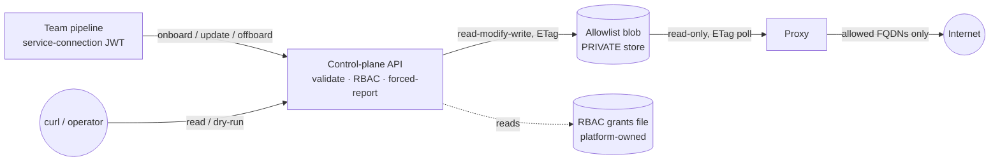

# Control plane

> **Status: proposed, not yet implemented.** This document records the design and the
> load-bearing decisions for the allowlist control plane. The full change (specs, design,
> tasks) lives under [`openspec/changes/control-plane-api/`](../openspec/changes/control-plane-api/).
> Concrete setup and `curl` usage land with the implementation.

The control plane is a **validating write path in front of the allowlist**. It lets teams
self-serve their workload's egress rules from a deployment pipeline, without handing anyone
direct write access to the allowlist store. The proxy is unchanged — it still reads one
rendered ACL, fail-closed, on its ETag poll.

## Operating modes

The allowlist can be maintained in one of four modes. Only **Mode 2** introduces the
control plane; the others frame where it sits.

| Mode | Who writes | Control plane? |
|---|---|---|
| **1 — GitOps** | one config file, PR-published on merge | **no** — direct blob write |
| **2 — Pipeline push** | each team's pipeline pushes its own ruleset via the API | **yes** |
| 3 — Management portal | humans edit via an app with per-ruleset RBAC | yes *(future)* |
| 4 — Mix & match | different rulesets sit at different modes | yes *(future)* |

**Without the control plane (Mode 1)** the blob is written directly (config-as-code, PR
review as the trust boundary) — the setup shipped today. See
[allowlist.md § Write path](allowlist.md).

**With the control plane (Mode 2)** the blob becomes the control plane's private store; the
only write path is the API, gated by platform-managed RBAC. Direct-write GitOps then exists
only in the no-control-plane topology — where the control plane runs, CI publishes by
*calling the API*.

## The ruleset model

A **ruleset** generalizes today's allowlist "module". It is the unit of policy, ownership,
and authorization:

```jsonc
{
  "name": "payments",                  // slug
  "subjects": ["<appid>", "10.2.0.0/23"], // workload identities / netids it governs
  "content": {
    "allowed_hosts": ["api.stripe.com"],
    "action": "enforce"                // enforce | report | open
  },
  "acl": { "edit": [], "push": [], "admin": [] } // reserved for Mode 3 (human edit)
}
```

Invariants:

- **One-to-one.** A subject belongs to **at most one** ruleset. No composition, union, or
  precedence — a single uniqueness invariant replaces all of that, and keeps the renderer a
  validator rather than a compositor.
- **Writer ≠ subject.** The identity allowed to write a ruleset is never the workload
  identity it governs. A compromised workload therefore cannot widen its own allowlist —
  the exact attack the proxy exists to stop.
- **Subjects are write-once at onboard.** They are set when the ruleset is created and are
  immutable under a content update.

## Authorization: platform-managed RBAC

Authority to change rulesets is **platform-managed RBAC**, not per-resource ACLs baked into
the data. The platform team grants pipeline (service-connection) identities three verbs:

| Verb | Grants | Scope |
|---|---|---|
| `onboard` | create a new ruleset (declaring its subjects) | registry — the ruleset doesn't exist yet |
| `update` | replace an existing ruleset's content | that ruleset |
| `offboard` | remove a ruleset, freeing its subjects | that ruleset |

- **Reads are open.** Any authenticated caller may list and read every ruleset — the egress
  posture is transparent by design. Only writes require a verb.
- **Trust-on-first-use ownership.** When an `onboard`-holder creates a ruleset, it is
  recorded as the owner and gains `update`/`offboard` on it — so onboarding costs one
  platform grant, not a ticket per module.
- **Enforce, don't investigate.** The control plane enforces the platform's grants and
  **never** reaches into Azure (ARM/Graph) to verify which identity owns which subject.
  Whether a service connection *should* onboard a given subject is the platform team's
  judgment, encoded when they provision it — which is where that knowledge lives. Squatting
  on an un-onboarded subject is bounded by how narrowly `onboard` is granted; uniqueness
  (first-come) protects already-onboarded subjects.

RBAC administration is a **platform-team responsibility**, done out of band for now (a
platform-owned grants file); managing it *through* the API is future work.

## The blob as a private store



| | Blob role |
|---|---|
| Control-plane API identity | **sole** `Storage Blob Data Contributor` (the only writer) |
| Proxy identity | `Storage Blob Data Reader` (read-only) |
| Pipelines / humans | **none** — reach the config only through the API |

The powerful write role is held by exactly one identity — the control plane — instead of
being sprayed across every team's pipeline. All policy (RBAC, forced-report, writer≠subject)
is therefore unavoidable on the write path. The proxy keeps its simple, dependency-free,
fail-closed read, so egress enforcement never depends on control-plane availability.

## API surface

| Endpoint | Verb required | Behaviour |
|---|---|---|
| `GET /rulesets` | none (auth only) | list all rulesets (transparency) |
| `GET /rulesets/{name}` | none (auth only) | read one ruleset |
| `PUT /rulesets/{name}` (absent) | `onboard` | create the ruleset, set subjects, TOFU ownership; new hosts forced to `report` |
| `PUT /rulesets/{name}` (exists) | `update` / owner | **full replace** of content; subjects/acl rejected |
| `POST /rulesets/{name}:check` | none (auth only) | dry-run: validate + coerce, return `{ added, removed }` diff, no write |
| `DELETE /rulesets/{name}` | `offboard` / owner | remove the ruleset, free its subjects (fail-closed) |

- **AuthN** reuses the proxy's RS256/JWKS token validation (`iss`/`aud`/`exp`) — one identity
  model across data plane and control plane.
- **Forced `report` on new hosts.** A newly added host is coerced to `report`; new endpoints
  cannot go straight to `enforce`. A freshly onboarded ruleset is therefore born entirely in
  `report` — the onboarding on-ramp: tune from the logs, then promote to `enforce`.
- **`PUT` is a full replace (desired-state).** A team keeps a rules file per environment in
  its repo; the pipeline pushes that file, so the ruleset always matches the repo and a host
  absent from the push is removed. Removals are audited (forced-`report` guards additions;
  the audit event guards removals), and `:check` surfaces them before a real push.
- **Concurrency.** ETag `If-Match` optimistic concurrency; the whole read-modify-write is
  wrapped in a bounded resilience retry (re-read + re-splice on 412), so concurrent writes to
  *different* rulesets don't collide. Sustained contention on the *same* ruleset surfaces as
  `409`.

## Load-bearing design decisions

| Decision | Why |
|---|---|
| **Ruleset = subject(s) + content + writer authority**, one-to-one with subjects | The unit of ownership is the workload's policy, not each host. One-to-one avoids a compositor and reduces conflict resolution to a uniqueness check. |
| **Writer ≠ subject; subjects write-once at onboard** | Keeps a compromised workload from widening its own rules, in steady state and at creation. |
| **Platform-managed RBAC (`onboard`/`update`/`offboard`), enforced not investigated** | Trust lives with the platform team that provisions the pipelines; the control plane stays a policy enforcement point, not an identity-provenance investigator coupled to ARM/Graph. |
| **Trust-on-first-use ownership** | Self-service onboarding without a platform ticket per module, while the platform retains the ability to override. |
| **Blob is the control plane's private store** (sole-writer API, read-only proxy, no pipeline blob role) | Concentrates the dangerous write role in one identity and makes all write-path policy unavoidable. |
| **Proxy reads the store directly, read-only** | Preserves the fail-closed, dependency-free poll; egress enforcement does not depend on control-plane uptime. |
| **Reads are open** | The egress posture is transparent; any team can see the whole picture. Only writes are gated. |

## Deferred (named, not built)

- Management portal + human `edit` verb (Mode 3), and RBAC administration through the API.
- Reassigning subjects after onboard via the API (platform op / offboard-and-re-onboard).
- Ruleset composition / many-to-many / a shared trusted-baseline ruleset — the `fallback`
  block covers a platform baseline for now.
- Per-ruleset blobs — the escape hatch if single-blob write contention ever bites; would
  reintroduce a compositor.
