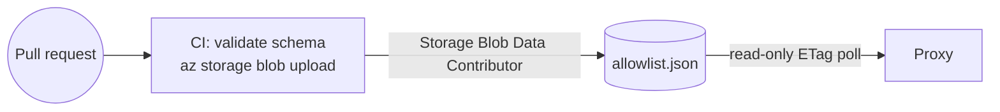
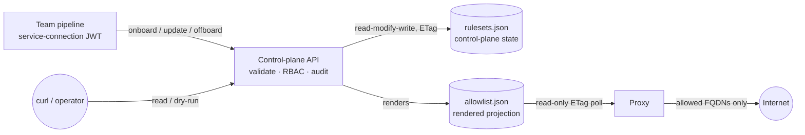

# Control plane

The control plane is a **validating write path in front of the allowlist**. It lets teams
self-serve their workload's egress rules from a deployment pipeline, without handing anyone
direct write access to the allowlist store. The proxy is unchanged — it still reads one
rendered ACL, fail-closed, on its ETag poll.

Code: [`src/ControlPlane/`](../src/ControlPlane/). Design record:
[`openspec/changes/control-plane-api/`](../openspec/changes/control-plane-api/).

## Operating modes

The allowlist can be maintained in one of four modes. Only **Mode 2** introduces the
control plane; the others frame where it sits.

| Mode | Who writes | Control plane? |
|---|---|---|
| **1 — GitOps** | one config file, PR-published on merge | **no** — direct blob write |
| **2 — Pipeline push** | each team's pipeline pushes its own ruleset via the API | **yes** |
| 3 — Management portal | humans edit via an app with per-ruleset RBAC | yes *(future)* |
| 4 — Mix & match | different rulesets sit at different modes | yes *(future)* |

## The two topologies

The same proxy, the same blob, two different write paths. Pick per environment; both are
supported by the Bicep in [`infra/`](../infra/), gated on one parameter.

### Without the control plane — GitOps (Mode 1)



Teams edit [`allowlist/allowlist.json`](../allowlist/allowlist.json); PR review is the trust
boundary; CI publishes on merge. **Choose this when** one team (or one review queue) owns
every workload's egress, the change rate is low, and config-as-code review is the control you
want. It is the simplest thing that works, and it is what this repo ships by default.

**Cost:** every egress change funnels through one shared file. A team cannot push its own
workload's rules without touching an artifact everyone else shares, and the CI identity holds
blob write for *all* rules.

### With the control plane — pipeline push (Mode 2)



Each team's pipeline pushes **only its own ruleset**, through an API that enforces policy the
pipeline cannot skip. **Choose this when** several teams own their own workloads and you want
self-service without granting blob write per team.

**Cost:** one more service to run and keep available. Note the proxy does *not* depend on it —
the proxy reads the blob directly, so egress enforcement survives control-plane downtime.

### Switching between them

Both topologies end at the same `allowlist.json`, so switching is a role-assignment change
plus a seed, not a migration:

- **Mode 1 → Mode 2**: deploy the control plane (`deployControlPlane=true`), seed
  `rulesets.json` with the rulesets equivalent to today's modules and the platform `grants`,
  then stop the CI allowlist publish. From that point CI publishes by *calling the API*.
- **Mode 2 → Mode 1**: stop calling the API, re-point CI at the blob, and keep the last
  rendered `allowlist.json` as the config-as-code artifact. Nothing in the proxy changes.

## The ruleset model

A **ruleset** is the set of rules applied to one or more clients of the proxy. It is the unit
of policy, ownership, and authorization, and it replaces "module" as the thing teams author.
Schema: [`allowlist/rulesets.schema.json`](../allowlist/rulesets.schema.json).

```jsonc
{
  "name": "payments",                            // slug
  "subjects": [{ "appid": "<client-id>" },       // workload identities / netids it governs
               { "netid": "10.2.0.0/23" }],
  "content": {
    "allowed_hosts": ["api.stripe.com"],         // exact FQDNs
    "action": "enforce"                          // enforce | report | open — uniform for the ruleset
  },
  "acl": { "edit": [], "push": [], "admin": [] },// reserved for Mode 3 (human edit)
  "owner": "<creator identity>"                  // recorded trust-on-first-use at onboard
}
```

Invariants:

- **One-to-one.** A subject belongs to **at most one** ruleset. No composition, union, or
  precedence — a single uniqueness invariant replaces all of that, and keeps the renderer a
  validator rather than a compositor.
- **Uniform evaluation.** A ruleset has exactly one `action`; its hosts are never evaluated
  under differing actions.
- **Writer ≠ subject.** The identity allowed to write a ruleset is never the workload identity
  it governs. A compromised workload therefore cannot widen its own allowlist — the exact
  attack the proxy exists to stop.
- **Subjects are write-once at onboard.** They are set when the ruleset is created and are
  immutable under a content update. (Restating them unchanged is fine, so a desired-state
  pipeline can keep pushing one file.)

### Rendering: why `allowlist.json` never changes

The proxy parses `allowlist.json` itself, so its schema is a **frozen contract**. The control
plane keeps rulesets in its own document and renders that one into the proxy's:

```
rulesets.json  ──render──▶  allowlist.json  ──poll──▶  proxy
(authored)                  (frozen schema)
```

One module entry is emitted **per subject** — the proxy keys each ACL entry on a single
identity. A single-subject ruleset keeps the ruleset name as its `id`, so an existing
hand-written allowlist renders back byte-identically (pinned by a test). The word `modules`
survives only inside that rendered file; under Mode 2 nobody authors it by hand.

## Authorization: platform-managed RBAC

Authority to change rulesets is **platform-managed RBAC**, held in the `grants` section of the
same state document and edited by the platform team out of band:

| Verb | Grants | Scope |
|---|---|---|
| `onboard` | create a new ruleset (declaring its subjects) | registry — the ruleset doesn't exist yet |
| `update` | replace an existing ruleset's content | that ruleset (or unscoped) |
| `offboard` | remove a ruleset, freeing its subjects | that ruleset (or unscoped) |

```jsonc
"grants": [
  { "identity": "<pipeline appid>", "verbs": ["onboard"] },
  { "identity": "<platform appid>", "verbs": ["onboard", "update", "offboard"] }  // unscoped
]
```

- **Reads are open.** Any authenticated caller may list and read every ruleset — the egress
  posture is transparent by design. Only writes require a verb.
- **Trust-on-first-use ownership.** When an `onboard`-holder creates a ruleset, it is recorded
  as `owner` and gains `update`/`offboard` on it — so onboarding costs one platform grant, not
  a ticket per ruleset.
- **Enforce, don't investigate.** The control plane enforces the platform's grants and
  **never** reaches into Azure (ARM/Graph) to verify which identity owns which subject.
  Squatting on an un-onboarded subject is bounded by how narrowly `onboard` is granted;
  uniqueness (first-come) protects already-onboarded subjects.
- The API **never writes the `grants` section** — every read-modify-write copies it through
  untouched, so the control plane cannot widen its own authority.

RBAC administration is a **platform-team responsibility**, done out of band for now; managing
it *through* the API is future work.

## The blob as a private store

| | Blob role |
|---|---|
| Control-plane API identity | `Storage Blob Data Contributor` — the only service that writes |
| Proxy identity | `Storage Blob Data Reader` (read-only) |
| Workload team pipelines | **none** — they reach the config only through the API |
| Platform team identity | `Storage Blob Data Contributor` — it owns the `grants` section |

The powerful write role stays with the control plane and the platform team instead of being
sprayed across every team's pipeline. All policy (RBAC, the onboard gate, writer≠subject) is
therefore unavoidable on the write path. Blob **versioning + soft delete** (14 days) stay on
for rollback.

## API surface

| Endpoint | Verb required | Behaviour |
|---|---|---|
| `GET /rulesets` | none (auth only) | list all rulesets (transparency) |
| `GET /rulesets/{name}` | none (auth only) | read one ruleset |
| `PUT /rulesets/{name}` (absent) | `onboard` | create it, set subjects, TOFU ownership; `report` if no action given |
| `PUT /rulesets/{name}` (exists) | `update` / owner | **full replace** of content; changing subjects/acl rejected |
| `POST /rulesets/{name}:check` | none (auth only) | dry-run: validate, return `{ added, removed }`, no write |
| `DELETE /rulesets/{name}` | `offboard` / owner | remove it, free its subjects (fail-closed) |

Status codes: `401` no/invalid token · `403` missing verb, or the caller is a governed subject ·
`400` invalid host, or an attempt to change frozen fields · `404` unknown ruleset ·
`409` subject already claimed by another ruleset, or sustained write contention.

- **AuthN** reuses the proxy's RS256/JWKS token validation (`iss`/`aud`/`exp`) — one identity
  model across data plane and control plane.
- **`report` is the onboarding default, never an override.** A ruleset onboarded *without* an
  explicit action starts in `report` — the on-ramp for a workload whose egress you do not yet
  know: tune from the logs, then promote with an explicit `enforce` push. An explicit action is
  always honoured, at onboard and after: `report` permits all traffic and only logs it, so
  overriding an explicit `enforce` would give a new workload more egress than it asked for. The
  control plane never lowers a ruleset's action on its own either — adding a host to an
  *already enforcing* ruleset does **not** downgrade it. What guards widening is the audit event
  per added host plus the `:check` diff.
- **`PUT` is a full replace (desired-state).** A team keeps a rules file per environment in its
  repo; the pipeline pushes that file, so the ruleset always matches the repo and a host absent
  from the push is removed. Removals are audited, and `:check` surfaces them before a push.
- **Concurrency.** ETag `If-Match` on the state blob; the whole read-modify-write is wrapped in
  a bounded retry (re-read + re-splice on 412), so concurrent writes to *different* rulesets
  don't collide. Sustained contention on the *same* ruleset surfaces as `409`.

### The loop, with `curl`

`$TOKEN` is the pipeline identity's token — locally from the mock IdP, in Azure from the
service connection's own managed identity.

```bash
API=http://localhost:5199        # or https://<control-plane>.<region>.azurecontainerapps.io

# See the whole posture (any valid token; no verb needed)
curl -s -H "Authorization: Bearer $TOKEN" $API/rulesets

# Onboard — declares subjects. No action given, so the on-ramp default applies.
# (Pass "action":"enforce" here instead and it is honoured: report is a default, not a gate.)
curl -s -X PUT -H "Authorization: Bearer $TOKEN" -H 'Content-Type: application/json' \
  -d '{"subjects":[{"appid":"33333333-3333-3333-3333-333333333333"}],
       "content":{"allowed_hosts":["api.stripe.com"]}}' \
  $API/rulesets/payments
# -> 201  "action":"report"  "owner":"<caller>"  "added":["api.stripe.com"]

# Dry-run the next push before making it — gate the pipeline on this diff
curl -s -X POST -H "Authorization: Bearer $TOKEN" -H 'Content-Type: application/json' \
  -d '{"content":{"allowed_hosts":["api.stripe.com","api.vendor.com"],"action":"enforce"}}' \
  $API/rulesets/payments:check
# -> 200  "added":["api.vendor.com"]  "removed":[]   (nothing written)

# Promote once the report-mode logs are clean
curl -s -X PUT -H "Authorization: Bearer $TOKEN" -H 'Content-Type: application/json' \
  -d '{"content":{"allowed_hosts":["api.stripe.com"],"action":"enforce"}}' \
  $API/rulesets/payments
# -> 200  "action":"enforce"

# Offboard — subjects fall to the fallback/deny block on the next reload
curl -s -X DELETE -H "Authorization: Bearer $TOKEN" $API/rulesets/payments
# -> 200  "removed":["api.stripe.com"]
```

## Setup

### GitOps topology (Mode 1) — the default

Nothing to do beyond the standard deploy: `deployControlPlane` defaults to `false`, the CI
identity keeps `Storage Blob Data Contributor`, and
[`.github/workflows/allowlist.yml`](../.github/workflows/allowlist.yml) publishes
`allowlist/allowlist.json` on merge. See [allowlist.md § Write path](allowlist.md#write-path).

### Control-plane topology (Mode 2)

1. **Build and push the control-plane image** to the ACR the deployment uses (it must be
   pullable under the egress floor — see [production-hardening.md](production-hardening.md)).
2. **Deploy with the control plane enabled:**
   ```bash
   az deployment sub create --template-file infra/main.bicep \
     --parameters deployControlPlane=true \
                  controlPlaneImage=<acr>.azurecr.io/control-plane:<tag> ...
   ```
   This creates the control plane's user-assigned identity **in the hub**, next to the storage
   it owns, grants it `Storage Blob Data Contributor`, and runs its container in the spoke's
   managed environment. The proxy's identity keeps `Storage Blob Data Reader`.
3. **Seed the state blob.** [`scripts/deploy.sh`](../scripts/deploy.sh) does this automatically
   when the control plane is deployed: it uploads
   [`allowlist/rulesets.json`](../allowlist/rulesets.json) — rulesets **and** the platform
   `grants` — to `egress-config/rulesets.json`, patched with the sample app's client id.
4. **Grant the team pipelines.** Add their service-connection identities to `grants`, usually
   just `onboard`, since trust-on-first-use covers everything they create. Editing `grants` is
   a platform-team blob write; the API will never do it.
5. **Give no workload pipeline a blob role.** That is the whole point: they reach the config
   only through the API.

### Configuration (env)

| Variable | Meaning |
|---|---|
| `STORAGE_SERVICE_URL` | Blob service endpoint, accessed via `DefaultAzureCredential` (set `AZURE_CLIENT_ID` to pick a user-assigned identity) |
| `ALLOWLIST_BLOB_CONNECTION_STRING` | Local/dev alternative (Azurite) |
| `ALLOWLIST_CONTAINER` | Container holding both blobs (default `egress-config`) |
| `RULESETS_BLOB` | Control-plane state (default `rulesets.json`) |
| `ALLOWLIST_BLOB` | Rendered projection the proxy reads (default `allowlist.json`) |
| `JWKS_URL`, `EXPECT_ISS`, `EXPECT_AUD` | Caller token validation — the same values the proxy uses |

## Local development

The control plane is wired into the Aspire AppHost, so the whole Mode 2 loop runs on a laptop
against Azurite and the mock IdP:

```bash
dotnet run --project src/AppHost/AppHost.csproj
```

That starts Azurite, the mock IdP, the seeder (which seeds **both** `allowlist.json` and
`rulesets.json`), the proxy, the sample app, and the control plane on
**http://localhost:5199**.

Two ways to explore the API:

- **Scalar UI** at <http://localhost:5199/scalar> — the generated API reference, with a token
  box that sends a real `Authorization: Bearer` header.
- **[`src/ControlPlane/ControlPlane.http`](../src/ControlPlane/ControlPlane.http)** — the same
  loop plus every refusal case, scriptable.

Both are Development-only, on the same reasoning as the health endpoints: a deployed control
plane should not publish its own API surface unauthenticated. Get a token with:

```bash
# A token for the demo pipeline identity that holds the grants in allowlist/rulesets.json.
# The mock IdP mints a token for any appid you ask for — local-only convenience.
TOKEN=$(curl -s "http://localhost:18080/token?appid=22222222-2222-2222-2222-222222222222")
```

Run the onboard → `:check` → promote → offboard loop above against the control plane's port
(shown in the Aspire dashboard), then watch the proxy pick it up within one poll interval
(`POLL_SECONDS=5`):

```bash
docker logs $(docker ps --format '{{.Names}}' | grep '^proxy-' | head -n1) | grep 'rendered ACL'
# -> rendered ACL from allowlist blob: modules=[payments sample-app] fallback=true etag="0x..."
```

A push therefore visibly changes proxy behaviour a few seconds later: the
`CANONICAL-PROXY-DECISION` lines flip to `"allow":false` for a host you removed, and back once
you push it again.

The demo identities seeded in `allowlist/rulesets.json` are `2222…` (a pipeline: registry-wide
`onboard`, plus `update`/`offboard` scoped to `sample-app`) and `9999…` (an unscoped platform
identity).

## Load-bearing design decisions

| Decision | Why |
|---|---|
| **Ruleset = subject(s) + content + writer authority**, one-to-one with subjects | The unit of ownership is the workload's policy, not each host. One-to-one avoids a compositor and reduces conflict resolution to a uniqueness check. |
| **`allowlist.json` is frozen; the control plane renders it** | The proxy parses that document, so renaming keys there would be a proxy change. Rendering keeps both the read contract and the proxy code untouched. |
| **Writer ≠ subject; subjects write-once at onboard** | Keeps a compromised workload from widening its own rules, in steady state and at creation. |
| **Platform-managed RBAC (`onboard`/`update`/`offboard`), enforced not investigated** | Trust lives with the platform team that provisions the pipelines; the control plane stays a policy enforcement point, not an identity-provenance investigator coupled to ARM/Graph. |
| **Trust-on-first-use ownership** | Self-service onboarding without a platform ticket per ruleset, while the platform retains the ability to override. |
| **`report` defaults at onboard; explicit actions always honoured; never a downgrade** | A workload whose egress is unknown is observed rather than broken — but `report` permits everything, so overriding an explicit `enforce` would grant *more* egress than asked for. Adding a host likewise never weakens rules already in force; the audit trail guards widening. |
| **All control-plane state in one blob** | One document is one linearizable state and one `If-Match` write; no cross-blob consistency to reason about. The cost: "the API cannot widen its own authority" is a code invariant rather than a permission boundary. |
| **Proxy reads the store directly, read-only** | Preserves the fail-closed, dependency-free poll; egress enforcement does not depend on control-plane uptime. |
| **Reads are open** | The egress posture is transparent; any team can see the whole picture. Only writes are gated. |

## Deferred (named, not built)

- Management portal + human `edit` verb (Mode 3), and RBAC administration through the API.
- Reassigning subjects after onboard via the API (platform op / offboard-and-re-onboard).
- Ruleset composition / many-to-many / a shared trusted-baseline ruleset — the `fallback`
  block covers a platform baseline for now.
- Per-ruleset blobs — the escape hatch if single-blob write contention ever bites; would
  reintroduce a compositor.
